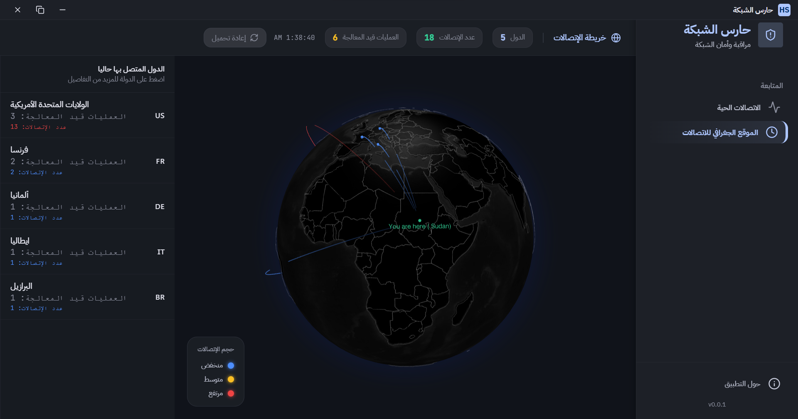
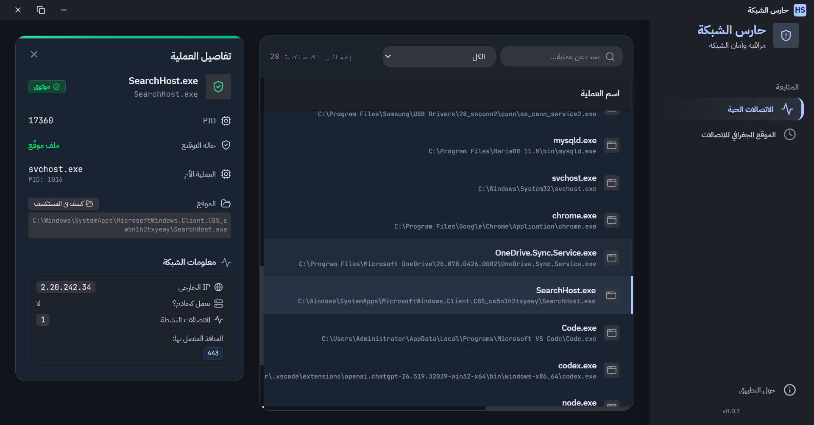
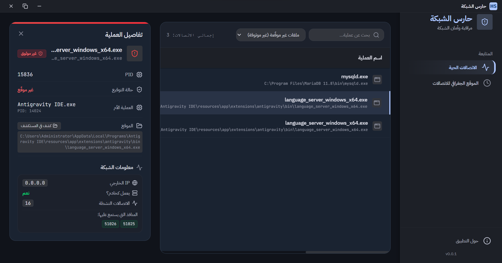

# Haris AL-Shabaka (A Network Traffic Analyzer) 🌐

## Overview
Network Traffic Analyzer is a desktop security tool that monitors all applications using the internet on your system.  
It helps you understand **which apps are sending data online** and highlights anything that looks suspicious or unusual.

The goal is simple:

> Detect which apps are using the internet and uncover potentially unsafe or unknown data transmission.

---

## 🚨 Main Purpose
This tool is built to:

- Show all running applications using internet traffic
- Identify which countries each app is sending information to
- Detect suspicious or unknown network behavior and locate the files behind it
- Help users protect their privacy and system security

---

## 🖼️ Screenshots

### 🌍 Interactive 3D Global Traffic Map
Visualizes live network traffic on a rotating 3D globe with animated connection arcs.

---

### 🧠 Process Intelligence View
Displays running processes, PIDs, and associated network activity.

---

### ⚠️ Security Classification Panel
Highlights safe, suspicious, and critical network behavior.

## 🌐 Key Features

### 📡 Real-Time Network Monitoring
- Tracks all active TCP/UDP connections
- Shows which process owns each connection
- Displays:
  - Remote IP addresses
  - Local ports
  - Connection status
  - Number of active connections per app
---

### 🧠 Process Intelligence
- Lists all running system processes
- Shows:
  - Process name and ID (PID)
  - Parent process relationship
  - Executable path

---

### ⚠️ Suspicious Activity Detection
Each process is automatically classified:

- **Safe** → Trusted / signed applications
- **Warning** → Unknown or unsigned apps
- **Critical** → High network activity + unsigned apps
- **System** → Core operating system processes

---

### 🌍 Global Traffic Mapping (Interactive 3D Globe)
One of the core features of this project is a **real-time interactive 3D globe visualization**:

- Shows live network connections between your device and other countries
- Draws animated arcs representing data flow across the world
- Displays glowing country markers based on traffic intensity
- Lets you click on any country to inspect:
  - Connected processes
  - IP addresses
  - Connection count

👉 This makes it easy to visually understand where your data is going globally.

---

### 🛰️ GeoIP Location Tracking
- Converts IP addresses into real-world locations
- Groups connections by country
- Displays:
  - Country name
  - Country code
  - Number of connections
  - Related processes

---

### 🌐 Public IP Detection
- Automatically detects your public (WAN) IP
- Identifies your current internet location
- Helps determine the origin of outbound traffic

---

## 🗺️ Interactive 3D Map Features

The application includes a **real-time 3D Earth visualization** powered by WebGL:

- 🌍 Rotating 3D globe
- ✈️ Animated connection arcs between countries
- 📍 Pulsing markers for active connections
- 🔥 Heat-based coloring (low → high traffic)
- 🖱️ Click-to-explore country details
- 🎯 Focus/zoom on selected traffic regions

This gives a **visual cybersecurity dashboard** instead of just raw data.

---

## 🛠️ Technologies Used

### Backend (Go)
- Go (Golang)
- Windows Win32 API (Process & system access)
- gopsutil (system + network monitoring)
- GeoIP2 (MaxMind geolocation database)
- syscall / unsafe (low-level system interaction)

---

### Frontend (React + Wails)
- React
- Wails v2 (Go ↔ UI bridge)
- Vite (build system)
- Tailwind CSS (styling)
- Radix UI (UI components)
- Lucide React (icons)

---

### 3D Visualization
- react-globe.gl
- Three.js
- TopoJSON (world map geometry)

---

## 📊 Use Cases
- Detect spyware or malware network activity
- Monitor which apps are sending data externally
- Understand system network behavior
- Improve privacy awareness
- Security auditing for personal or enterprise systems

---

## ⚡ Performance Highlights
- Native OS-level process scanning (fast snapshot-based)
- Efficient per-process connection grouping
- Minimal overhead real-time updates
- Microsecond-level metadata inspection

---

## 🧩 Summary
This tool answers one important question:

> **Which applications are using my internet, and where is my data going?**

With a combination of **process analysis + network monitoring + 3D world visualization**, it turns raw system data into an understandable security map.

---

## Roadmap (Todo next)
- Extracts vendor information (e.g. Microsoft, Windows)
- Detect sudden, unexpected spikes in transmission volume
- Add background process to log activity
- Add real time alerts

## 📄 License

This project is licensed under the **MIT License**.

You are free to:
- Use
- Modify
- Distribute
- Integrate into other projects

### Conditions
- You must include the original license notice in any copy or derivative work.

### Disclaimer
This software is provided "as is", without warranty of any kind. The authors are not responsible for any misuse or damage caused by this tool.